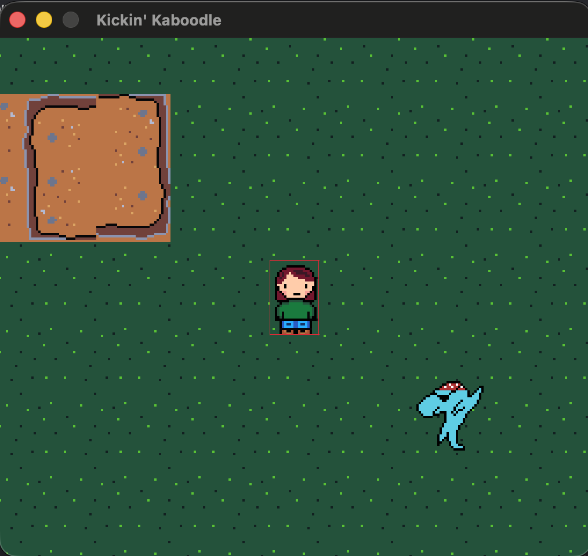

<!--
-->
# Isaiah Heinze

## I am a student at Chicago City Colleges studying computer science

* I'm finishing up my first year, and I am looking to transfer to a university Fall 2027!

## I am working on a rock paper scissor 32 bit rpg game!!

  
  

* I'm using C++ and the raylib library for this project.
* It is very early alpha...
* The assets are made using Aseprite

## Some technologies I am familar with are:
* C++
* Godot
* Python
